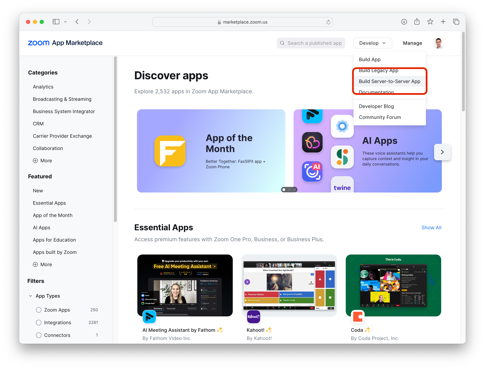
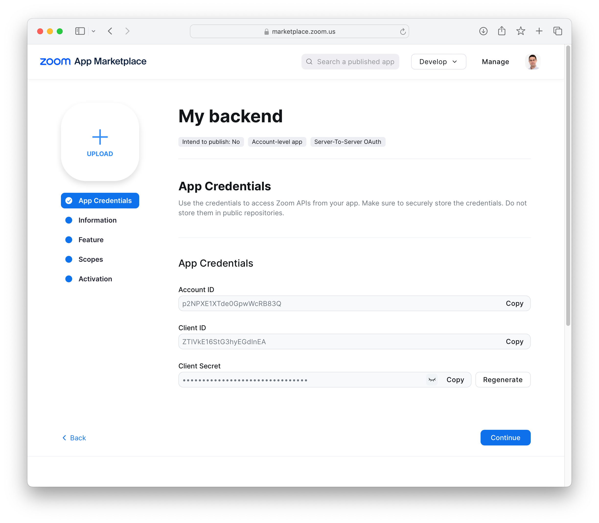
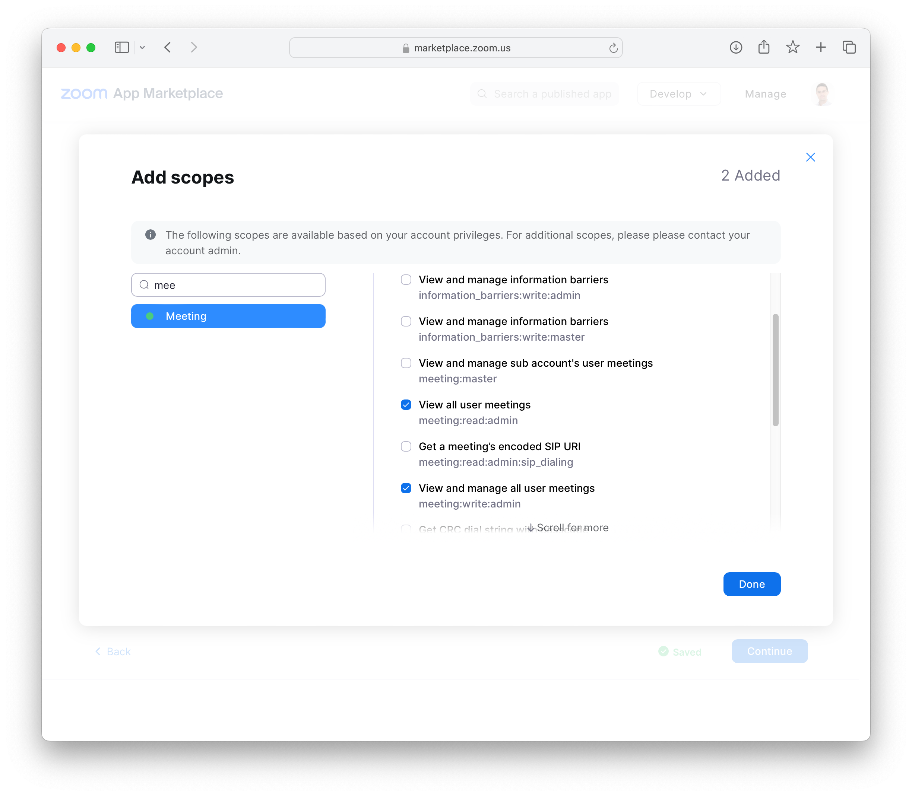
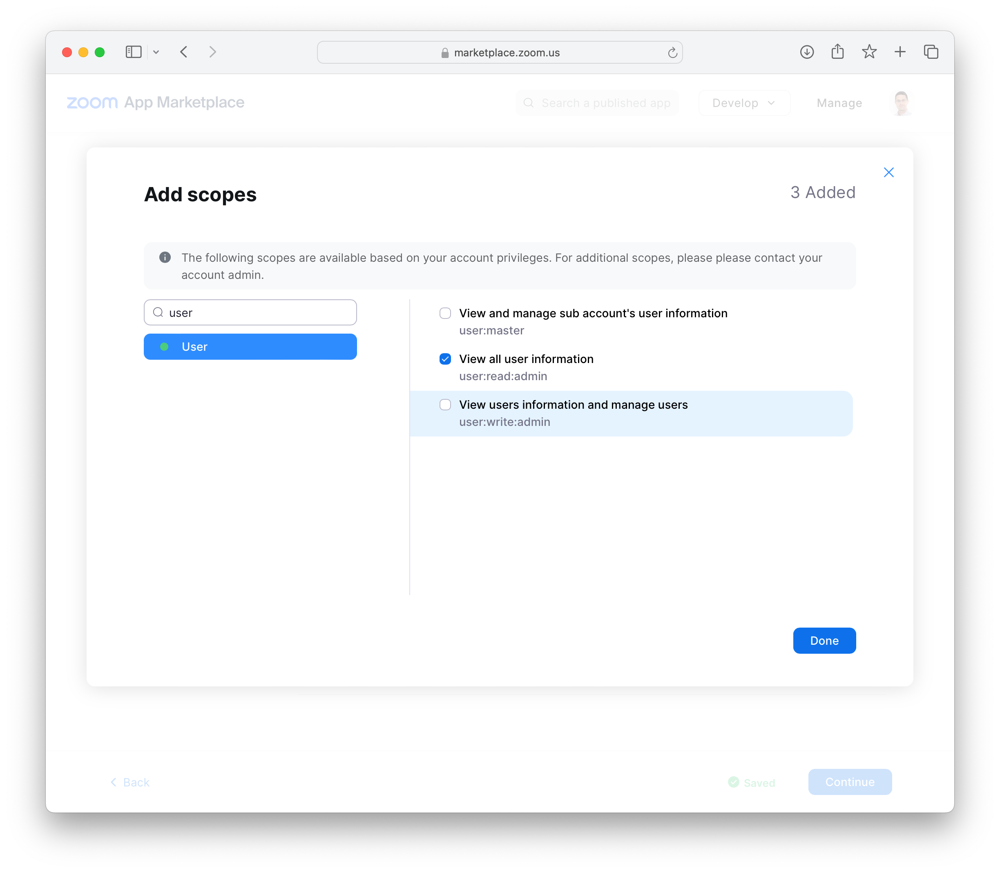

# Zoom Meeting Scheduler


A simple app to schedule a zoom meeting.

Client generated using `npx create-react-app client --template typescript`.
Backend inspired from https://dev.to/zoom/build-full-stack-meeting-conference-react-application-1no8

## Zoom resources
1. Create a Zoom account
2. From the "marketplace", create a "server to server OAuth app".  
3. Copy `Account ID`, `Client ID` and `Client Secret` into the `.env` file. 
4. Configure app to have the following accesses: `meeting:read`, `meeting:write` and `user:read` (not really sure if the last one if really necessary, though).   

You should be good to go...


## How to run the client

```shell
cd client
npm install
npm start
```


## How to run the backend

```shell
cd backend
npm install
npm start
```

Run with autoreload
```shell
npm run debug
```


### Testing the backend with curl

* Get all meetings:
```shell
curl -X GET http://localhost:30010/api/zoom/meetings
```

* Create a new meeting:
```shell
curl -X POST http://localhost:30010/api/zoom/meetings -d "{}"
```
Yes, you can create a meeting with no data!!!!